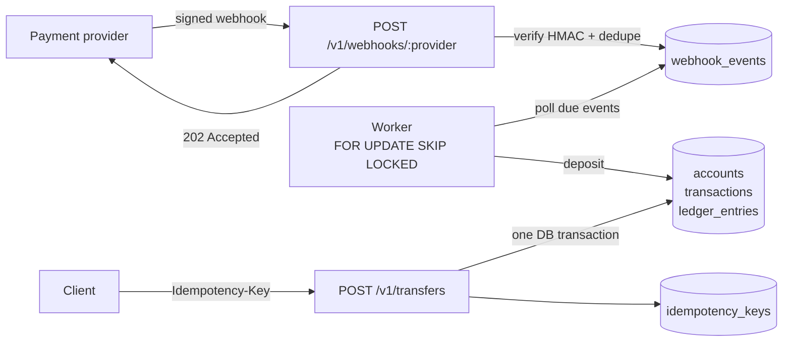

# go-payments-ledger

A payments microservice in Go: a **double-entry ledger** with **idempotent transfers** and a **secure webhook receiver** that processes payment-provider events asynchronously, with retries.

It focuses on the problems that matter in real financial systems: never moving money twice, never losing an event, never overdrawing an account under concurrency, and never trusting an unsigned request.


## Features

- **Double-entry ledger.** Every movement is a transaction whose entries sum to zero. Balances are cached on the account and updated in the same database transaction.
- **Idempotent transfers.** `POST /v1/transfers` requires an `Idempotency-Key`. A retried request returns the original result (`Idempotent-Replayed: true`); reusing a key with a different payload is rejected.
- **Signed webhooks.** HMAC-SHA256 over `timestamp.body`, constant-time comparison and a 5-minute tolerance window against replay attacks.
- **Deduplicated, asynchronous processing.** Events are stored once (`UNIQUE (provider, event_id)`), acknowledged immediately with `202`, and applied by a background worker.
- **Retries with exponential backoff.** Transient failures are retried (2s, 4s, 8s… capped at 10 min); business-rule failures (unknown account, currency mismatch) fail fast.
- **Safe under concurrency.** Row locks taken in a deterministic order prevent deadlocks; a `CHECK` constraint guarantees balances never go negative.
- **Production basics.** Structured JSON logs (`slog`), request IDs, panic recovery, body size limits, HTTP timeouts and graceful shutdown.

## Architecture



## Design decisions

| Decision | Why |
|---|---|
| Amounts as `int64` minor units (cents) | Floating point cannot represent money exactly. |
| Double-entry instead of a single balance column | Every cent is traceable; the ledger can always be audited and reconciled. |
| Idempotency key stored **in the same transaction** as the postings | The key and the money movement commit or roll back together, so a retry can never apply a transfer twice. Concurrent requests with the same key serialize on the primary key. |
| Accounts locked in sorted ID order | Two opposite transfers (A→B and B→A) would otherwise deadlock. |
| Receive fast, process later | Providers time out and retry; acknowledging in milliseconds and processing in a worker keeps the integration stable. |
| `FOR UPDATE SKIP LOCKED` | Several worker replicas can run in parallel without processing the same event. |
| Savepoint around each event | A failed posting is rolled back while the failed attempt is still recorded in the same transaction. |
| `transactions.reference` is `UNIQUE` | A second idempotency layer: the same provider event can never produce two deposits. |

## Running

Requirements: Docker, or Go 1.22+ with PostgreSQL 13+.

```bash
make up              # Postgres + API on :8080
```

Try it:

```bash
# create two accounts
A=$(curl -s -X POST localhost:8080/v1/accounts -d '{"currency":"BRL"}' | jq -r .id)
B=$(curl -s -X POST localhost:8080/v1/accounts -d '{"currency":"BRL"}' | jq -r .id)

# the provider confirms a R$100.00 payment into A (send it twice: credited once)
go run ./cmd/webhook-sim -account $A -amount 10000 -event evt_123
go run ./cmd/webhook-sim -account $A -amount 10000 -event evt_123

curl -s localhost:8080/v1/accounts/$A                 # balance: 10000

# transfer R$25.00; repeating the same key replays the original result
curl -s -X POST localhost:8080/v1/transfers \
  -H "Idempotency-Key: order-42" \
  -d "{\"from_account_id\":\"$A\",\"to_account_id\":\"$B\",\"amount\":2500,\"currency\":\"BRL\"}"

curl -s localhost:8080/v1/accounts/$A/entries         # account statement
```

## API

| Method | Path | Description |
|---|---|---|
| `POST` | `/v1/accounts` | Create an account `{"currency":"BRL"}` |
| `GET` | `/v1/accounts/{id}` | Account with current balance |
| `GET` | `/v1/accounts/{id}/entries` | Latest 50 ledger entries |
| `POST` | `/v1/transfers` | Transfer between accounts (requires `Idempotency-Key`) |
| `POST` | `/v1/webhooks/{provider}` | Receive a signed provider event (`X-Signature: t=…,v1=…`) |
| `GET` | `/healthz` | Liveness check |

Errors use a consistent shape: `{"error": {"code": "insufficient_funds", "message": "..."}}`.

## Testing

```bash
make test               # unit tests
docker compose up -d db
make test-integration   # unit + integration tests with the race detector
```

The integration suite covers money movement, insufficient funds, idempotent replay, key reuse, validation, webhook deduplication, signature rejection, and **25 concurrent transfers racing for the same balance** (exactly 10 succeed, the balance never goes negative).

## Project structure

```
cmd/api/              service entrypoint (config, wiring, graceful shutdown)
cmd/webhook-sim/      CLI that simulates a provider sending signed webhooks
internal/ledger/      domain: accounts, double-entry postings, idempotent transfers
internal/webhook/     signature verification, event store, async worker
internal/httpapi/     routes, handlers, error mapping, middleware
internal/database/    connection and embedded SQL migrations
```

## Roadmap

- [ ] Publish ledger events to a message broker (transactional outbox → SQS/Kafka)
- [ ] Prometheus metrics (request latency, webhook lag, retry count) and OpenTelemetry tracing
- [ ] Expiration (TTL) for idempotency keys
- [ ] OpenAPI specification
- [ ] Refund event (`payment.refunded`) and reversal transactions
